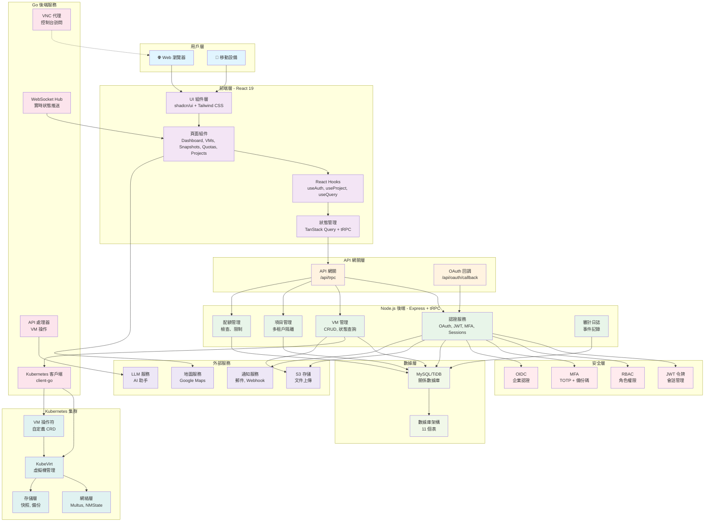
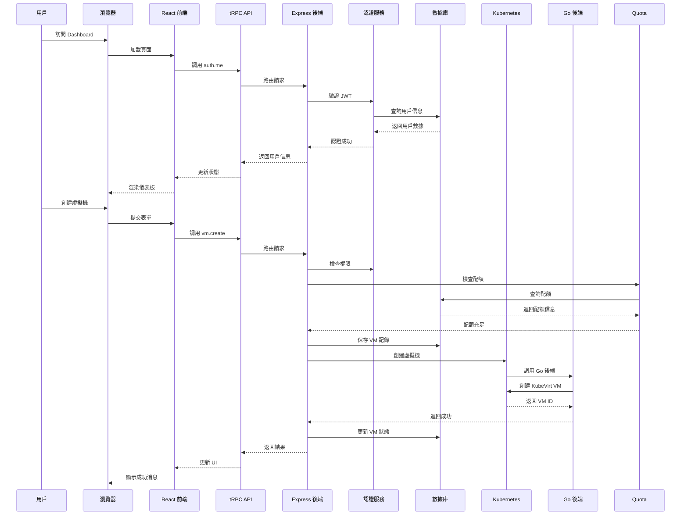
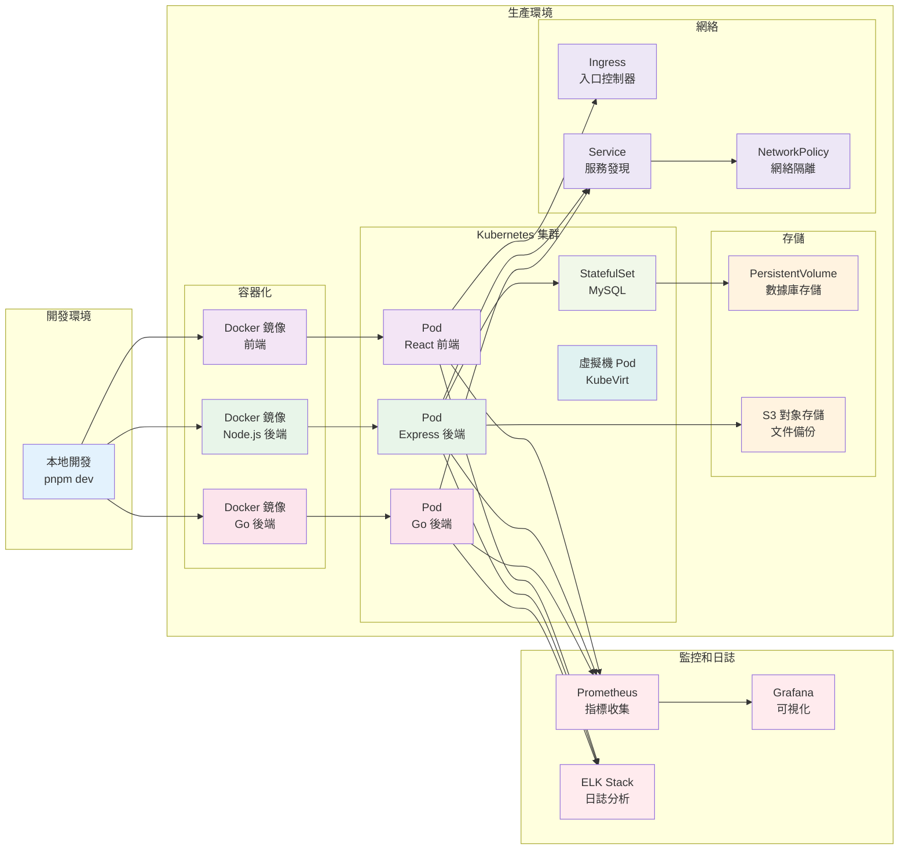
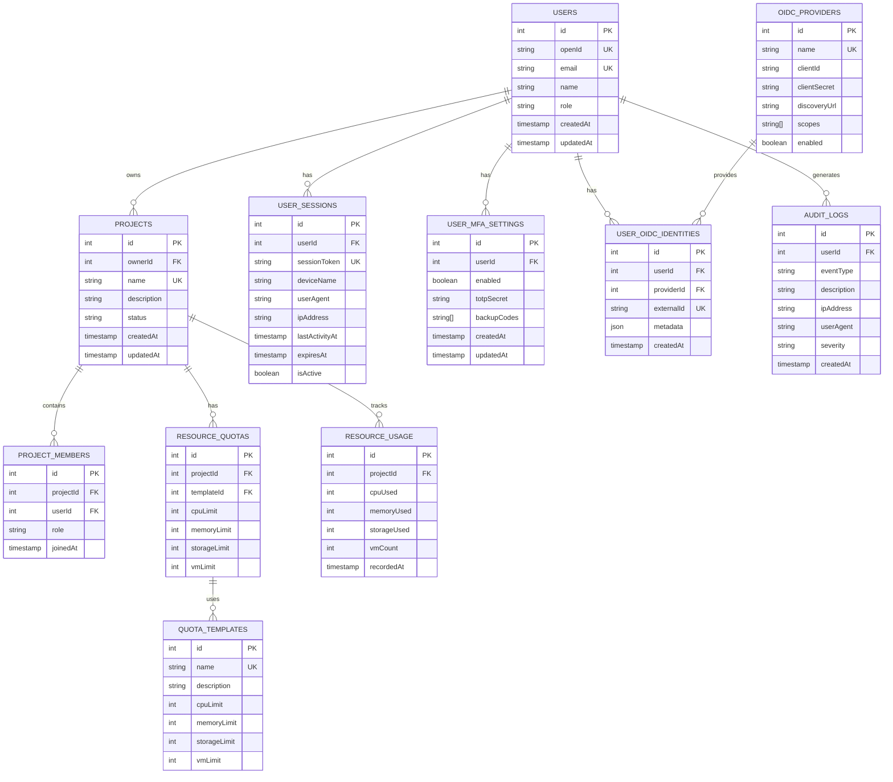
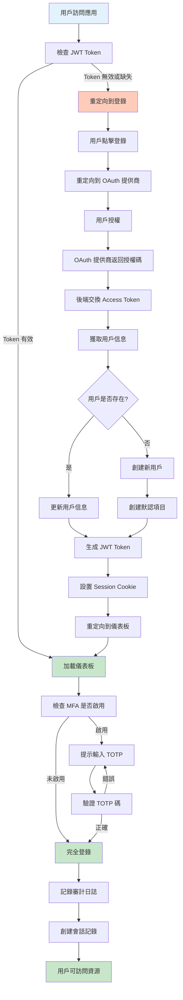
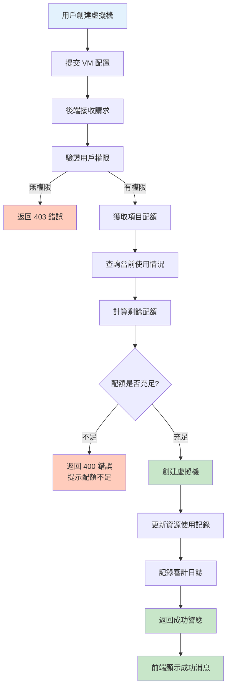
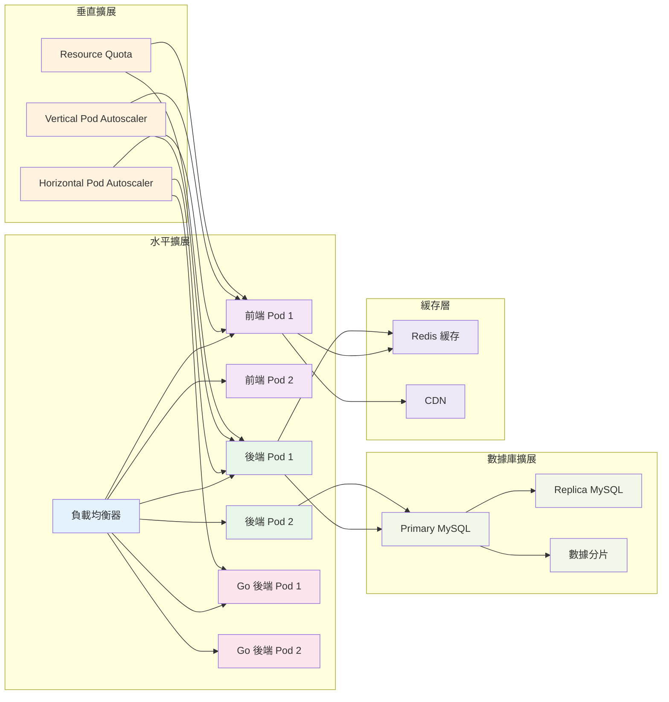
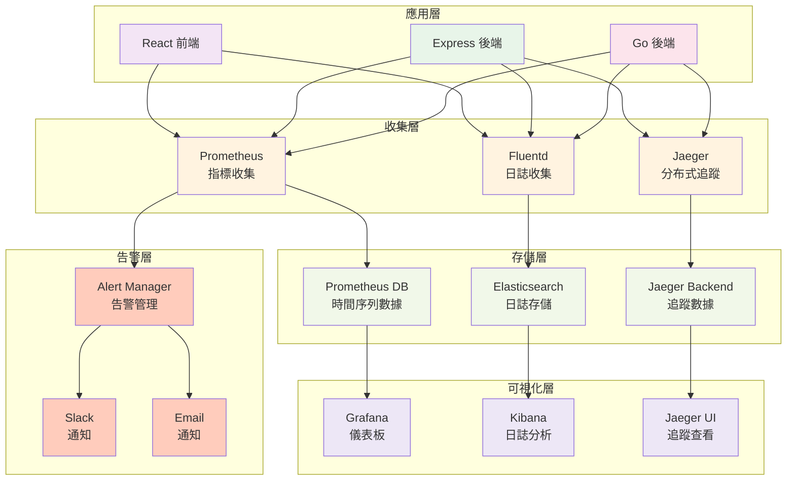

# Wukong Dashboard - 技術架構文檔

## 系統架構圖

---

## 數據流架構

---

## 部署架構

---

## 數據庫架構

---

## 認證流程

---

## 配額檢查流程

---

## 安全架構

```mermaid
graph TB
    subgraph "邊界安全"
        Firewall["防火牆"]
        WAF["Web 應用防火牆"]
        DDoS["DDoS 防護"]
    end

    subgraph "傳輸安全"
        TLS["TLS 1.3 加密"]
        HTTPS["HTTPS"]
        JWT["JWT 令牌"]
    end

    subgraph "應用安全"
        RBAC["RBAC 權限控制"]
        MFA["多因素認證"]
        SessionMgmt["會話管理"]
        InputValidation["輸入驗證"]
        CSRF["CSRF 防護"]
    end

    subgraph "數據安全"
        Encryption["數據加密"]
        Hashing["密碼哈希"]
        Audit["審計日誌"]
    end

    subgraph "基礎設施安全"
        NetworkPolicy["網絡隔離"]
        RBAC_K8s["Kubernetes RBAC"]
        SecretMgmt["密鑰管理"]
    end

    User["用戶"] --> Firewall
    Firewall --> WAF
    WAF --> DDoS
    DDoS --> HTTPS
    HTTPS --> TLS
    TLS --> JWT
    
    JWT --> RBAC
    RBAC --> MFA
    MFA --> SessionMgmt
    SessionMgmt --> InputValidation
    InputValidation --> CSRF
    
    CSRF --> Encryption
    Encryption --> Hashing
    Hashing --> Audit
    
    Audit --> NetworkPolicy
    NetworkPolicy --> RBAC_K8s
    RBAC_K8s --> SecretMgmt

    style Firewall fill:#ffccbc
    style WAF fill:#ffccbc
    style DDoS fill:#ffccbc
    style TLS fill:#ffe0b2
    style HTTPS fill:#ffe0b2
    style JWT fill:#ffe0b2
    style RBAC fill:#fff9c4
    style MFA fill:#fff9c4
    style SessionMgmt fill:#fff9c4
    style InputValidation fill:#fff9c4
    style CSRF fill:#fff9c4
    style Encryption fill:#c8e6c9
    style Hashing fill:#c8e6c9
    style Audit fill:#c8e6c9
    style NetworkPolicy fill:#b3e5fc
    style RBAC_K8s fill:#b3e5fc
    style SecretMgmt fill:#b3e5fc
```

---

## 擴展性架構

---

## 監控和日誌架構

---

## 關鍵技術決策

| 決策 | 選擇 | 原因 |
|------|------|------|
| 前端框架 | React 19 | 生態成熟，組件豐富 |
| 後端框架 | Express + tRPC | 類型安全，開發效率高 |
| 數據庫 | MySQL/TiDB | 關係型數據，ACID 保證 |
| ORM | Drizzle | 類型安全，輕量級 |
| 認證 | OAuth 2.0 + JWT | 安全標準，易於集成 |
| 容器化 | Docker | 標準化部署 |
| 編排 | Kubernetes | 生產級別，自動擴展 |
| 虛擬化 | KubeVirt | 原生 Kubernetes 集成 |
| Go 後端 | Gin + client-go | 高性能，官方支持 |
| 測試 | Vitest | 快速，TypeScript 友好 |

---

## 性能指標目標

| 指標 | 目標 | 說明 |
|------|------|------|
| 首屏加載時間 | < 2s | 優化前端資源 |
| API 響應時間 | < 200ms | 99% 請求 |
| 數據庫查詢時間 | < 50ms | 平均查詢 |
| 系統可用性 | 99.9% | 月度 SLA |
| 最大並發用戶 | 10,000+ | 水平擴展 |
| 虛擬機創建時間 | < 30s | 端到端 |

---

## 災難恢復計劃

| 場景 | RTO | RPO | 恢復方案 |
|------|-----|-----|---------|
| 單個 Pod 故障 | 1 分鐘 | 0 | 自動重啟 |
| 節點故障 | 5 分鐘 | 0 | Pod 遷移 |
| 數據庫故障 | 10 分鐘 | 1 分鐘 | 主從切換 |
| 區域故障 | 1 小時 | 15 分鐘 | 跨區域恢復 |
| 完全故障 | 4 小時 | 1 小時 | 備份恢復 |

---

**最後更新：** 2026年1月11日
